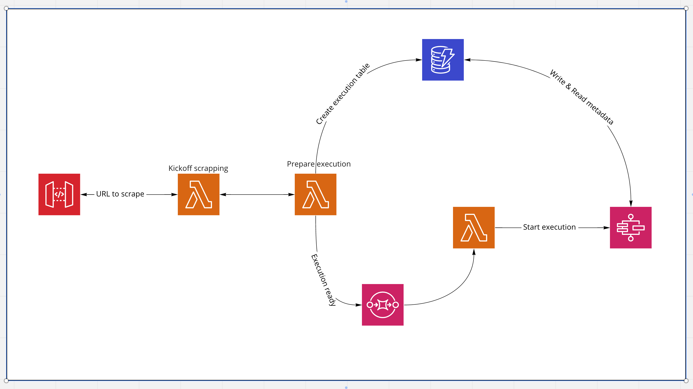

# Serverless web scraping with Step Functions

This is an example of how one might implement a serverless web scrapper.

High-level architectural overview



And the _Step Function_ that orchestrates the scrapping


## To deploy

1. Make sure you have all AWS-related environment variables setup
2. Build the backend

   ```sh
   cd src && make build
   ```

3. Bootstrap the CDK application

   ```sh
   cd infrastructure && npm run cdk bootstrap
   ```

4. Deploy the infrastructure

   ```sh
   cd infrastructure && npm run deploy
   ```

5. Amend the `src/Makefile` (the `queue` command) with the _CloudFormation outputs_.

6. Queue the scrape

   ```sh
   cd src && make queue
   ```

## Disclaimer

Please note that this is not production ready. There are no tests. I did not pay attention to code readability or structure while writing this.
